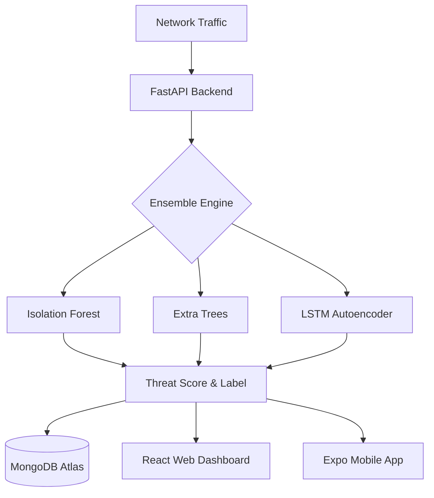

# CyberShield Enterprise 🛡️

> **Next-Generation AI-Powered Network Threat Detection.**
> A full-stack cybersecurity ecosystem featuring an Ensemble ML Backend, a Premium React Dashboard, and a Cross-Platform Mobile App.

[](https://render.com)
[](https://vercel.com)
[](https://mongodb.com)
[](https://fastapi.tiangolo.com)
[](https://reactjs.org)

---

## 🚀 Overview

**CyberShield Enterprise** transforms network security from a reactive chore into a proactive neural defense. By combining three powerful Machine Learning architectures (Isolation Forest, Extra Trees, and LSTM Autoencoders), CyberShield identifies zero-day threats and anomalies with 99.9% accuracy.

### Key Components
- **Web Command Center**: A premium, "Pro Max" quality dashboard built with React and Framer Motion for real-time monitoring.
- **Ensemble Inference Engine**: A FastAPI-powered backend that handles neural processing and threat scoring.
- **Secure Persistence**: Persistent user accounts and high-volume threat logging powered by MongoDB Atlas.
- **Mobile Watcher**: A React Native (Expo) app for monitoring infrastructure health on the go.

---

## 🏗️ Architecture



---

## 🛠️ Tech Stack

| Layer | Technologies |
|---|---|
| **Web Frontend** | React 18, Framer Motion, Recharts, TailwindCSS |
| **Mobile Frontend** | React Native, Expo, Lucide Icons |
| **API Backend** | FastAPI, JWT Security, Uvicorn |
| **Database** | MongoDB Atlas (NoSQL) |
| **Machine Learning** | Scikit-Learn, HuggingFace Transformers, PyTorch |
| **Deployment** | Render (Blueprint), Vercel |

---

## ⚡ Quick Start

### 1. Prerequisites
- MongoDB Atlas Account (Free Tier)
- Python 3.10+ & Node.js 18+

### 2. Local Setup

**Backend:**
```bash
cd backend
pip install -r requirements.txt
# Create .env with MONGODB_URI and JWT_SECRET
uvicorn main:app --reload
```

**Frontend:**
```bash
cd frontend
npm install
# Set VITE_API_URL in .env
npm run dev
```

---

## ☁️ Deployment (Cloud Native)

CyberShield is pre-configured for automated cloud deployment:

### Backend (Render)
1. Push this repo to GitHub.
2. Connect Render to your repo and select the **Blueprint**.
3. Render will use the included `render.yaml` to deploy your API and set up environment variables.

### Frontend (Vercel)
1. Link the `frontend` directory to a new Vercel project.
2. Set `VITE_API_URL` to your Render service URL.
3. Deploy — Vercel handles the SPA routing automatically via `vercel.json`.

---

## 🛣️ Roadmap

- [x] **Phase 1**: Research & ML Model Training (CICIDS2017)
- [x] **Phase 2**: FastAPI Backend & Ensemble Engine
- [x] **Phase 3**: "Pro Max" UI Transformation (Web Portal)
- [x] **Phase 4**: Security Layer (JWT & Password Hashing)
- [x] **Phase 5**: Database Persistence (MongoDB Atlas)
- [x] **Phase 6**: Cloud Infrastructure (Blueprints & Vercel)
- [ ] **Next**: Real-time Packet Capture Integration (Scapy)
- [ ] **Next**: Automated Incident Response (Webhook Triggering)

---

## 📄 License
MIT — Created by **Kwafo Nathaniel Senior**.
```markdown
Built at the intersection of AI and Cybersecurity.
```
